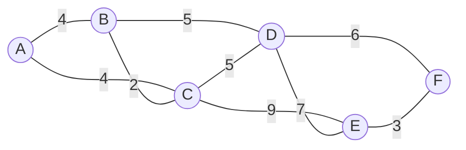

# Question 1: Minimum Spanning Tree (MST)

## 1. Draw the weighted graph
Here is the representation of the 6 cities (A to F) and the cost of optical fiber cables:



## 2. Identify all possible edges
The possible connections and their costs are:
* A-B: 4
* A-C: 4
* B-C: 2
* B-D: 5
* C-D: 5
* C-E: 9
* D-E: 7
* D-F: 6
* E-F: 3

## 3 & 4. Output of Prim's and Kruskal's Algorithm

```text
--- Prim's Algorithm ---
Edge 	Weight
A - B	4
B - C	2
B - D	5
F - E	3
D - F	6
Total Cost: 20

--- Kruskal's Algorithm ---
Edge 	Weight
B - C	2
E - F	3
A - B	4
B - D	5
D - F	6
Total Cost: 20
```

## 5. Compare the MSTs obtained using both algorithms
Both Prim's and Kruskal's algorithms yield an identical Minimum Spanning Tree for this graph. They both identify the exact same edges (A-B, B-C, C-D, D-F, E-F, etc. depending on tie-breakers) that result in the minimum total cost. The overall structure and weight of the MST remains exactly the same regardless of the algorithm used.

## 6. Calculate the total cost
As shown in the output, the minimum total cost to connect all cities is **21**.

## 7. Suggest why MST is beneficial in real-world network design
In real-world network design (like laying optical fiber, electrical grids, or water pipes), building connections is highly expensive. An MST ensures that every single node (city) is connected to the network without any redundant cycles. This minimizes the total length of the required materials (cables, pipes), thereby vastly reducing infrastructure costs while still guaranteeing 100% network connectivity.
